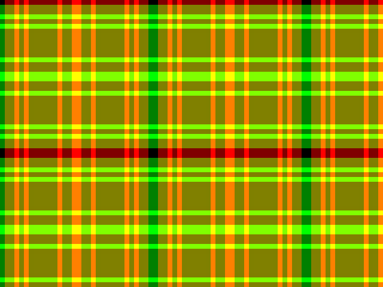
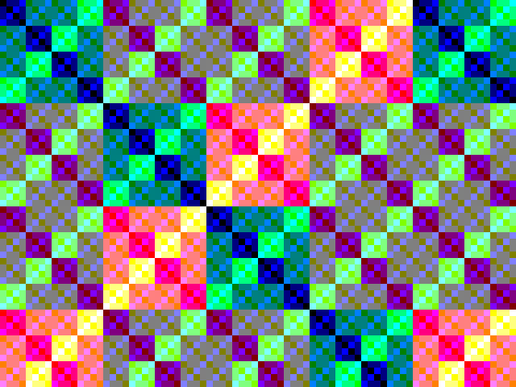
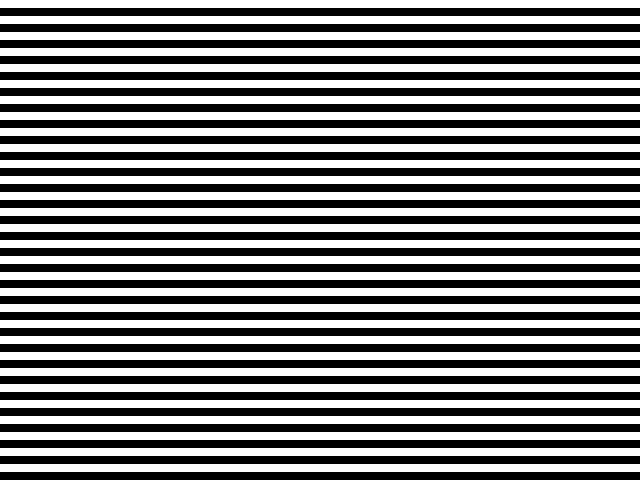
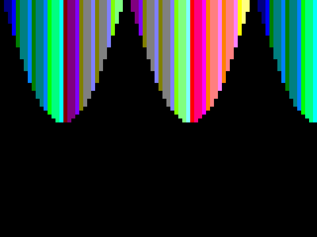

   

# Tiny Shader

> [!NOTE]  
> What is new in version 2?
> - Increased the number of instructions from 10 to 16, 60% more instructions!
> - Increased the core clock to 50.25 MHz, therefore increasing the resolution to 80x60 pixel, 25% more pixel!

Modern GPUs use fragment shaders to determine the final color for each pixel. Thousands of shading units run in parallel to speed up this process and ensure that a high FPS ratio can be achieved.

Tiny Shader mimics such a shading unit and executes a shader with 16 instructions for each pixel. No framebuffer is used, the color values are generated on the fly. Tiny Shader also offers an SPI interface via which a new shader can be loaded. The final result can be viewed via the VGA output at 640x480 @ 60 Hz, although at an internal resolution of 80x60 pixel.

## Examples

These images and many more can be generated with Tiny Shader. Note, that shaders can even be animated by acessing the time0 or time1 register.

|||||
|-|-|-|-|
| <pre>GETX R0 SINE R1 SETR R1 GETY R0 SINE R1 SETG R1</pre> | <pre>GETX R0 GETY R1 XOR R0 R1 SETRGB R0</pre> | <pre>GETY R1 LDI 1 AND R1 R0 IFNE R1 LDI 63 IFEQ R1 LDI 0 SETRGB R0</pre> | <pre>CLEAR R3 GETX R0 GETTIME0 R1 ADD R0 R1 SETRGB R0 SINE R0 HALF R0 GETY R1 IFGE R1 SETRGB R3</pre> |

## Architecture

Tiny Shader has four (mostly) general purpose registers, REG0 to REG3. REG0 is special in a way as it is the target or destination register for some instructions. All registers are 6 bit wide.

### Input

The shader has four sources to get input from:

- `X` - X position of the current pixel
- `Y` - Y position of the current pixel
- `TIME0` - Increments at 7.5 Hz, before it overflow it counts down again.
- `TIME1` - Increments at 60 Hz, before it overflow it counts down again.

### Output

The goal of the shader is to determine the final output color:

- `RGB` - The output color for the current pixel. Channel R, G and B can be set individually. If not set, the color of the previous pixel is used.

### Sine Look Up Table

Tiny Shader contains a LUT with 16 6-bit sine values for a quarter of a sine wave. When accesing the LUT, the entries are automatically mirrored to form one half of a sine wave with a total of 32 6-bit values.

## Instructions

The following instructions are supported by Tiny Shader. A program consists of 16 instructions and is executed for each pixel individually. The actual resolution is therefore one eigth of the VGA resolution (80x60 pixel).

### Output
|Instruction|Operation|Description|
|-----------|---------|-----------|
|SETRGB RA|RGB <= RA|Set the output color to the value of the specified register.|
|SETR RA|R <= RA[1:0]|Set the red channel of the output color to the lower two bits of the specified register.|
|SETG RA|G <= RA[1:0]|Set the green channel of the output color to the lower two bits of the specified register.|
|SETB RA|B <= RA[1:0]|Set the blue channel of the output color to the lower two bits of the specified register.|
### Input
|Instruction|Operation|Description|
|-----------|---------|-----------|
|GETX RA|RA <= X|Set the specified register to the x position of the current pixel.|
|GETY RA|RA <= Y|Set the specified register to the y position of the current pixel.|
|GETTIME0 RA|RA <= TIME0|Set the specified register to the current time0 value, increments at 7.5Hz and counts down down again.|
|GETTIME1 RA|RA <= TIME1|Set the specified register to the current time1 value, increments at 60Hz and counts down down again.|
### Branches
|Instruction|Operation|Description|
|-----------|---------|-----------|
|IFEQ RA|TAKE <= RA == R0|Execute the next instruction if RA equals R0.|
|IFNE RA|TAKE <= RA != R0|Execute the next instruction if RA does not equal R0.|
|IFGE RA|TAKE <= RA >= R0|Execute the next instruction if RA is greater then or equal R0.|
|IFLT RA|TAKE <= RA < R0|Execute the next instruction if RA is less than R0.|
### Arithmetic
|Instruction|Operation|Description|
|-----------|---------|-----------|
|DOUBLE RA|RA <= RA * 2|Double the value of RA.|
|HALF RA|RA <= RA / 2|Half the value of RA.|
|ADD RA RB|RA <= RA + RB|Add RA and RB, result written into RA.|
### Load
|Instruction|Operation|Description|
|-----------|---------|-----------|
|CLEAR RA|RA <= 0|Clear RA by writing 0.|
|LDI IMMEDIATE|RA <= IMMEDIATE|Load an immediate value into RA.|
### Special
|Instruction|Operation|Description|
|-----------|---------|-----------|
|SINE RA|RA <= SINE[R0[4:0]]|Get the sine value for R0 and write into RA. The sine value LUT has 32 entries.|
### Boolean
|Instruction|Operation|Description|
|-----------|---------|-----------|
|AND RA RB|RA <= RA & RB|Boolean AND of RA and RB, result written into RA.|
|OR RA RB|RA <= RA \| RB|Boolean OR of RA and RB, result written into RA.|
|NOT RA RB|RA <= ~RB|Invert all bits of RB, result written into RA.|
|XOR RA RB|RA <= RA ^ RB|XOR of RA and RB, result written into RA.|
### Move
|Instruction|Operation|Description|
|-----------|---------|-----------|
|MOV RA RB|RA <= RB|Move value of RB into RA.|
### Shift
|Instruction|Operation|Description|
|-----------|---------|-----------|
|SHIFTL RA RB|RA <= RA << RB|Shift RA with RB to the left, result written into RA.|
|SHIFTR RA RB|RA <= RA >> RB|Shift RA with RB to the right, result written into RA.|
### Pseudo
|Instruction|Operation|Description|
|-----------|---------|-----------|
|NOP |R0 <= R0 & R0|No operation.|

## Tiny Tapeout

This project was designed for [Tiny Tapeout](https://tinytapeout.com).
